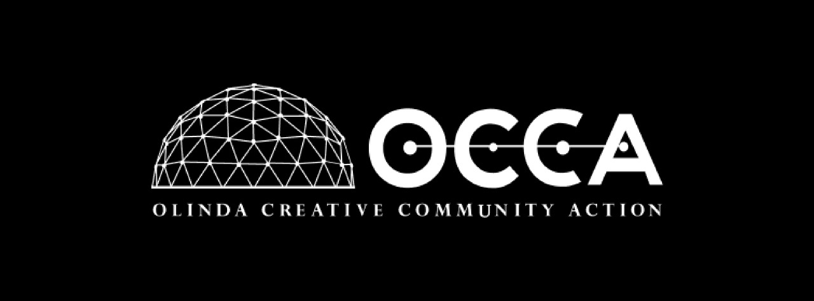
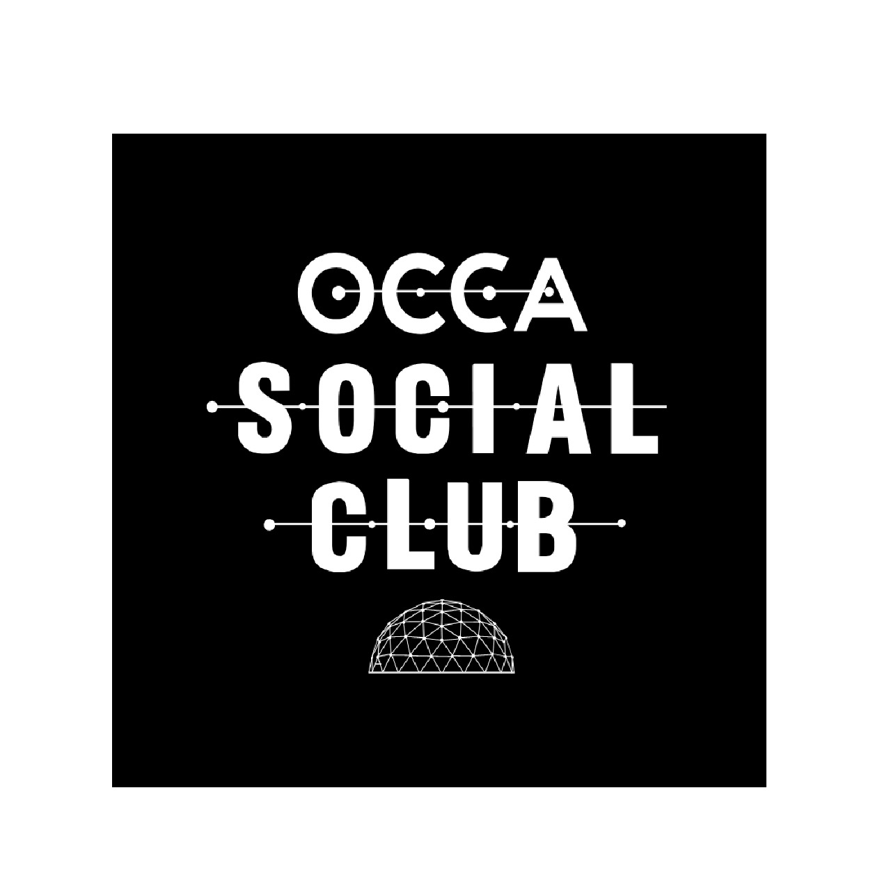
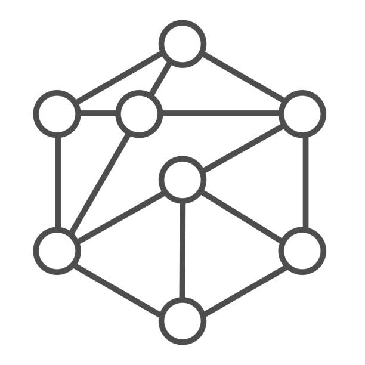
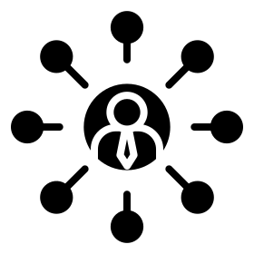

# OCCA — Olinda Creative Community Action!

  

## 👉 O que é OCCA?

  A OCCA (Olinda Creative Community Action) é uma associação sem fins lucrativos que reúne pessoas físicas e jurídicas dedicadas ao desenvolvimento de novos modelos de educação empreendedora, inovação, e economia criativa. Localizada na Rua 13 de Maio, 229, no centro do Sítio Histórico de Olinda, a OCCA atua como um espaço integrador criativo, promovendo oficinas, projetos e atividades relacionadas a STEAM (Science, Technology, Engineering, Arts, and Mathematics).
 

 
## 👉 Como Surgiu?

OCCA teve início em 2020, a partir de uma conversa entre 10 amigos na casa que hoje abriga a sede da associação. Surgiu inicialmente como resposta à pandemia do COVID-19, com uma força-tarefa para produção de Faceshields. Rapidamente, evoluiu para um espaço dedicado à cultura maker, economia criativa, tecnologia, inovação e sustentabilidade, tornando-se uma entidade sem fins lucrativos em menos de um ano.

## 👍 Curtiu o projeto?

  • Visite o site e confira informações sobre a nossa equipe e projetos!
   
  

  • Inscreva-se no YouTube para conferir nossos conteúdos!
   
  

  • Siga-nos no LinkedIn e acompanhe conteúdo sobre os nossos projetos e carreira!
   
  

  • Siga-nos no Instagram para acompanhar conteúdos educacionais, divertidos e vagas!
   
   

## 💡 Iniciativas que podem impulsionar a sua carreira:

<table align="center">
  <tr>
    <td align="center" width="96">
        
       OCCA Social Club
    </td>
    <td align="center" width="96">
        
        Networking
    <td align="center" width="96">
        
        SoftSkills
    </td>    
  </tr>
</table>
 

## 🤔 Como fazer parte do OCCA Social Club?
- Confira os requisitos:
    > OCCA Social Club é um programa com periodo minimo de 3 meses. O limite atual de membros envolvidos enquanto membro do OCCA Social Club é de 20 pessoas. Sendo assim, quando se encerra o ciclo de 3 meses é aberto mais algumas vagas para começar novamente. 
- Deu match? Faça a sua inscrição <a href="https://linktr.ee/occa.space">aqui</a>!
